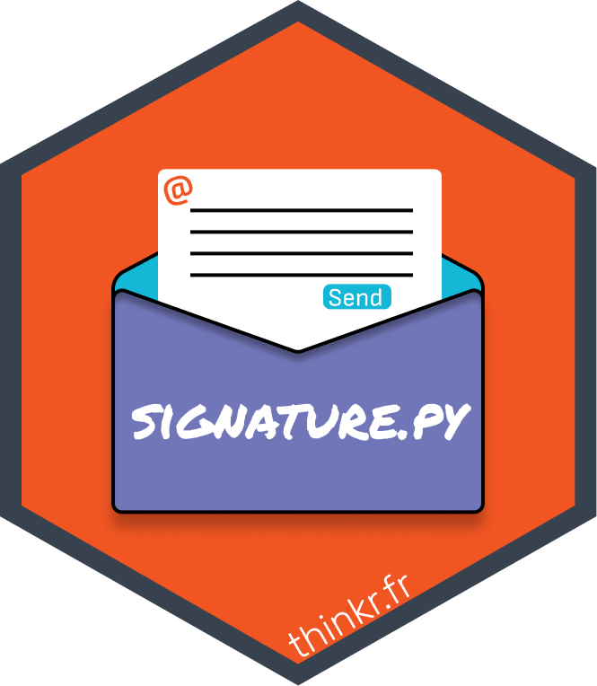
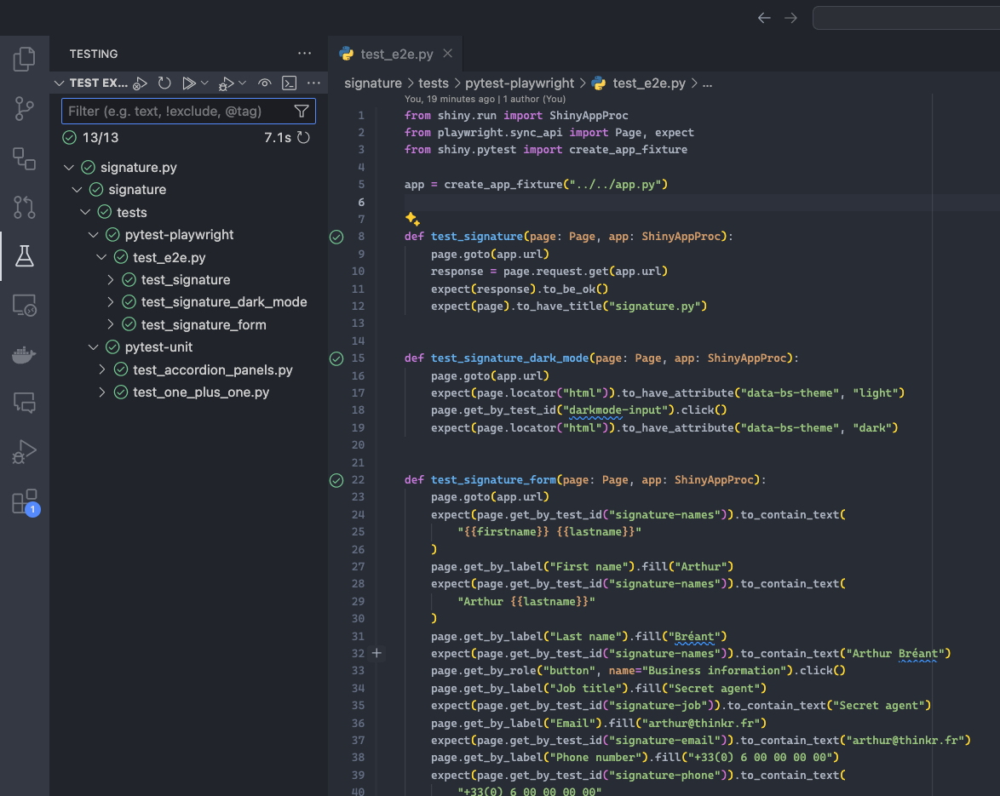

# Signature.py </a>


[](https://www.figma.com/proto/u95KvEqgWLB8arxt7saZcJ/%7Bsignature%7D?node-id=705-5&t=xevegkmzONTrRyR3-8&scaling=contain&content-scaling=fixed&page-id=0%3A1&starting-point-node-id=705%3A5&hide-ui=1)

[](https://github.com/ThinkR-open/signature.py/actions/workflows/run-pytest.yaml)

This is the python version of the [`{signature.r}`](https://github.com/ThinkR-open/signature.r) and [`{signature.js}`](https://github.com/ThinkR-open/signature.js) application.

This application provides a graphical interface to streamline the creation and maintenance of your email signature.

No more wrestling with images or getting tangled up in HTML code; the application offers a set of fields to update your signature easily.

Simply enter your name, first name, email, and other necessary information to populate your signature.

Additionally, the application allows you to copy the HTML code with a single button click, making it easy to paste into your email client settings.

Lastly, updating the banner (the image at the bottom of the signature) and the associated link for redirection is straightforward. You no longer need to request everyone to update their signature individually for these changes.

## Demo

🕹️ Try the app at:
[https://connect.thinkr.fr/signature-py/](https://connect.thinkr.fr/signature-py/)

## Try locally

1. Clone the repository

2. Install [pipx](https://github.com/pypa/pipx?tab=readme-ov-file#install-pipx)

3. Install [poetry](https://python-poetry.org/docs/)

4. Navigate to the project directory and install the dependencies

```bash
poetry install
```

5. Activate the virtual environment

```bash
poetry shell
```

6. Run the app

```bash
shiny run --reload signature/app.py
```

or shortcut:

```bash
poe runshiny
```

## Modify the theme

This app uses Bootstrap `5.3.3`.

To modify the theme, edit the `signature/scss/signature.css` file.

To compile the SCSS to CSS, run:

```bash
cd signature
sass scss/signature.scss css/signature.css
```

## How the redirection banner works?

The redirection banner is a JavaScript function that redirects the user to the specified URL.

To modify the redirection URL, edit the `index.html` file at the root of the project.

## Mockup

The mockup was created using [Figma](https://www.figma.com/).

Explore the mockup [here](https://www.figma.com/proto/u95KvEqgWLB8arxt7saZcJ/%7Bsignature%7D?node-id=705-5&t=xevegkmzONTrRyR3-8&scaling=contain&content-scaling=fixed&page-id=0%3A1&starting-point-node-id=705%3A5&hide-ui=1).

## Deployment

The app is deployed on Connect.

```bash
poetry shell
cd signature
rsconnect write-manifest shiny . --overwrite
```

Then update `requirements.txt` :

```bash
poetry export --without-hashes --format=requirements.txt > requirements.txt
```

## Tests

To run the tests, use the following command:

```bash
poetry run pytest
```

or

```bash
poetry run pytest --github-report --verbose
```

or shortcut:

```bash
poe test
```

If you are using VSCode, you can also dowload the 'Playwright Test' extension and run the tests from the testing tab.



[Playwright Test](https://marketplace.visualstudio.com/items?itemName=ms-playwright.playwright)

## Poe commands

This project uses the `poe` command to run the app, tests, and other commands.

To see the available commands, run:

```bash
poe
```

All the commands are defined in the `pyproject.toml` file.

Create a new command by adding a new entry in the `tasks` section of the `pyproject.toml` file.

```toml
[tool.poe.tasks]
hello = "echo 'Hello, world!'"
```

## You love this project?

You love this project and would like to reuse it for your own needs?

You can fork this repository and adapt it to your needs.

What you can do:

- fork this repository

- adapt the signature template to your needs. The template is located in the `signature/template` folder. Edit the `template.html` file to modify the signature template.

- modify the app to add or remove fields from the signature form to edit the signature.

- update tests to match the new fields.

- modify the redirection banner to redirect to your own URL.

- modify the theme by editing the `signature/scss/signature.scss` file.

- Remove google analytics from tag script in the `app.py` file.

- deploy the app on your own server.

- share the app with your colleagues.

- enjoy the app!
